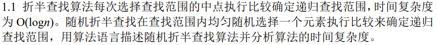
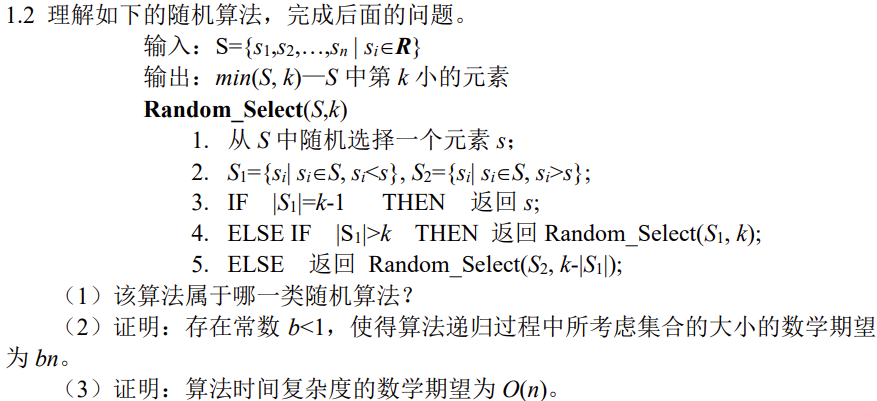
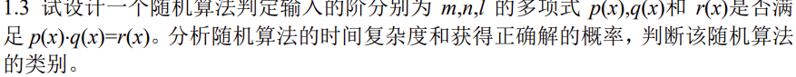
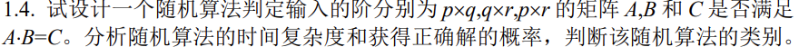
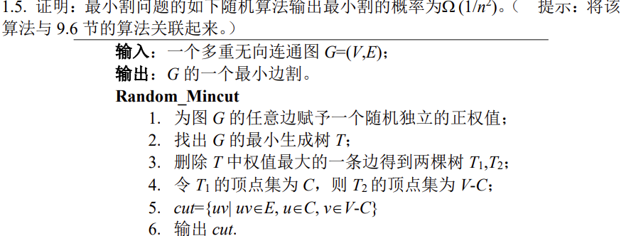
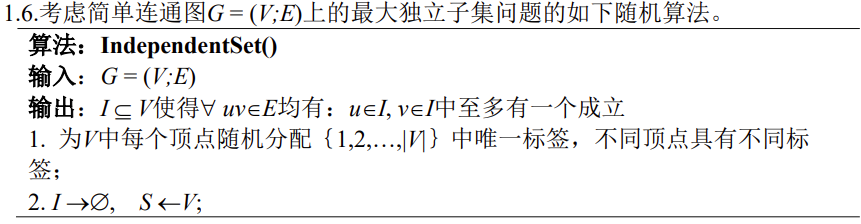
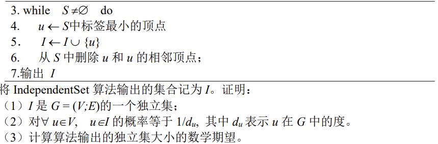
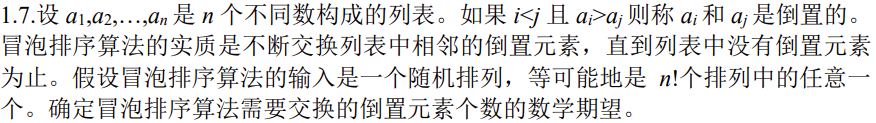
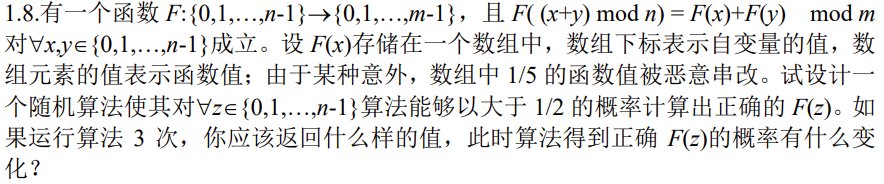

# 高级算法 作业1

## 1.1



```c++
int randBinSearch(int arr[],int l,int r, int x){
    if (r >= l)
    {
        int mid = getRandom(l, r);
        if (arr[mid] == x)
            return mid;
        if (arr[mid] > x)
          	return randomizedBinarySearch(arr, l,mid-1, x);
        return randomizedBinarySearch(arr, mid+1,r, x);
    }
    return -1;
}
```
基于递归的思想实现随机折半查找如上所示，时间复杂度推导如下：
$$
对于数组中的任意元素，选中的概率有p=\frac1n，因此我们有时间复杂度 \\
T(n) = 1+p\sum_{i=1}^n T(i) \\
即 n \cdot T(n) = \sum_{i=1}^n T(i) +n  \space (eq1)\\
同理，又有n-1成立\\
即(n-1) \cdot T(n-1) = \sum_{i=1}^{n-1} T(i) +n-1 \space (eq2)\\
由eq1 - eq2得\\
n\cdot T(n) - (n-1)\cdot T(n-1) = T(n) +1 \\
即 (n-1) \cdot T(n) = (n-1) T(n-1) +1 \\
即 T(n) = T(n-1) +\frac1{n-1} \\
显然，T(n) 是 调和级数，因此T(n) = O(\log n)
$$

## 1.2 



### 1.2.1

属于Las Vegas算法。该算法最终一定可以找到正确解，但是可能需要反复调用该算法来逼近解的范围。

### 1.2.2


对于 $\forall s_i \in S$，一定有$a(a<n)$项元素$s$满足$s < s_i$或$s>s_i$，因此第一次在$S$中随机选择一个元素，有且仅有以下两种情况 
* 当小于$s_i$的元素集合，其大小$a$满足$a>k$时，此时所考虑集合最大为$a$，之后递归调用该算法时同样使用该集合，因此集合大小总不会超过$a$
* 当小于$s_i$的元素集合，其大小$a$满足$a<k$时，此时需要考察的集合大小为$(k-a)$，同理，之后的集合大小也总不会超过$(k-a)$

因此，我们一定有一个满足某种比例$b=\frac an或b=\frac{k-a}{n}$的常数$b<1$，使得算法递归过程中考虑集合大小为$bn$
不失一般性的，我们总能在一个可排序的数列的任意项找到对应的$b$，将该性质推广到整个数列寻找期望，当存在一项取$b=\frac an$时，必有一项取$b=\frac{k-a}n$，则有对应$b=\frac an或b=\frac{k-a}{n}$可相互抵消，因此总的期望为$bn$，而$b$的取值与$k$有关。

### 1.2.3

由于我们是在数列中随机选取，因此有$E(X_i) = \frac 1n$ ，于是我们考察$T(n)$，可以得到
$T(n) \leq \sum_{i=1}^n X_i \cdot (T(max(i-1,n-i)) + O(n)) $

即$T(n) = \sum_{i=1}^n X_i \cdot T(max(i-1,n-i)) + O(n)$

于是有$E(T(n) )  \leq \sum_{i=1}^n \frac1n  \cdot E(T(max(i-1,n-i))) + O(n)$​

由$max(i-1,n-i)$的取值，我们有$E(T(n) )  \leq \frac2n\sum_{i=\lfloor n/2 \rfloor }^{n -1}  \cdot E(T(i)) + O(n)$

由1.2.2知，对于$\forall i $存在一个集合期望大小为$bn$，因此$E(T(n)) \leq bn$

即期望为$O(n)$


## 1.3

基于蒙特卡洛法设计算法如下

```c++
bool isEq(poly p,poly q,poly r){
    int m = p.rank;
    int n = q.rank;
    int l = r.rank;
    
    int k = max(m+n,l);
    
    int* nums = Random(k); //获取k个随机数
    
    for (int i = 0;i < k ;i++){
        int x = nums[i];
        if(p.eval(x)*q.eval(x) != r.eval(x)){
            return false;
        }
    }
    return true;
}
```

显然算法的时间复杂度是$O(max(m+n,l))$
假如满足等式成立，那么在实数集上的所有值一定同时成立，我们设实数集的基数为$N$
于是有获得正确解的概率为$1-\frac{max(m+n,l)}{N}$


## 1.4



基于蒙特卡洛法设计如下

```
for _ in range(k){
	for i in Random(p) {	
        for j in Random(r) {
            if A第i行 乘 B第j列 != C[i][j] {
                return false;
            }
        }
    }
}
    
return true;
```

时间复杂度为$O(q\times k)$，获得正确解的概率是$1 - (\frac {pr-1}{pr})^k$


## 1.5



记事件A为Random_Mincut算法输出正确的最小割

往证$P(A) = \Omega(1/n^2)$

我们已知，有事件B为CONTRACTION算法满足输出正确的最小割，满足$P(B) =\Omega(1/n^2)$

即证事件A与事件B等价，事件A与事件B可以是同一图G调用不同算法的结果

即证Random_Mincut 与 CONTRACTION等价，记为算法左与算法右等价


* 从左到右：我们由算法左获得子树T1与T2，将每个子树视为点的集合，即可得到算法右所需的收缩终点，此时介于两个子树之间的边均属于算法右中连接节点集合的边，因此，此时可以将算法左转换为算法右
* 从右到左：我们由算法右获得节点集合A和B，将节点集合对应的点内部展开，可以构成一个可能有环的连通图，可能存在的环不影响连通性，故将多余的边去掉即可构成生成树，因此获得两个生成树，此时算法右转换为算法左
* 综上所述，算法左与算法右在最后输出结果时一定等价，因此Random_Mincut输出最小割的概率也是$\Omega(1/n^2)$


## 1.6





## 1.6.1

往证$I$是$G$​的独立集

即证$\forall uv \in E$有$u\in I ,v\in I$互斥


采取反证法：

假设存在一对节点$u,v$满足$uv\in E$且$u\in I,v\in I$

由$uv$是边集合中的一条边可知，$uv$相邻

与算法第6步中，从S中删除u和u的相邻节点，故$\forall u,v \in I,uv$在图$G$中一定不相邻，产生矛盾
故$I$是$G$​的独立集


## 1.6.2

对于一个节点，它在独立集中的条件即它的相邻节点都不被选中的情况下选中该节点

显然其概率为$\frac1{d_u}$


## 1.6.3

期望是$\frac{n}{d_u}$

## 1.7



在实数域上考察一个特定实数，我们可以确定任意一个实数大于或小于这个实数的概率是1/2。

因此，当我们在进行冒泡排序时，每个数与其之后的数相比，产生逆序的概率都是1/2，排序共产生$C_n^2$次比较

综上所述，数学期望应为$C_n^2 * \frac12 = \frac{n(n-1)}{4}$


## 1.8



在0到n-1中随机抽取一项作为x，取最小的满足$(x+y) mod n = z$的y

此时我们有$F(z) = F(x) + F(y) mod m$

由于x和y的选取不独立，因此我们有错误的概率为 $P = P(F(x)错 \or F(y)错) \leq 1/5 + 1/5 = 2/5$

此时正确的概率大于1/2


算法运行三次后应该返回出现次数最多的值，每次计算错误的概率都小于2/5，则三次计算仍选到错误答案的概率为
$C_3^2 P^2 (1-P) + C_3^3P3 = 44/125$

故此时正确的概率是$81/125$
