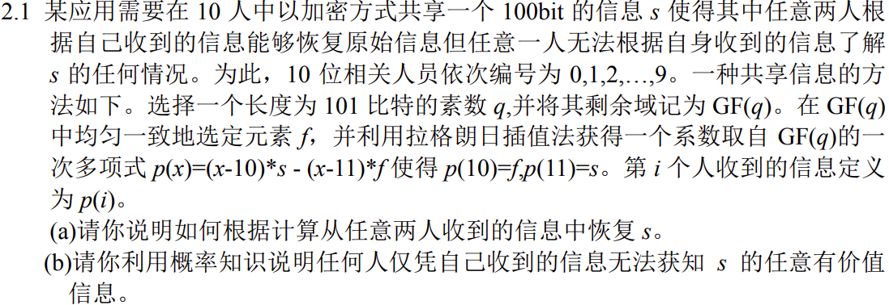
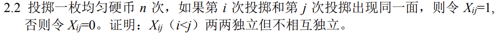
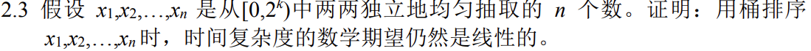
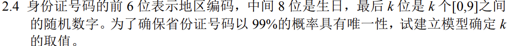
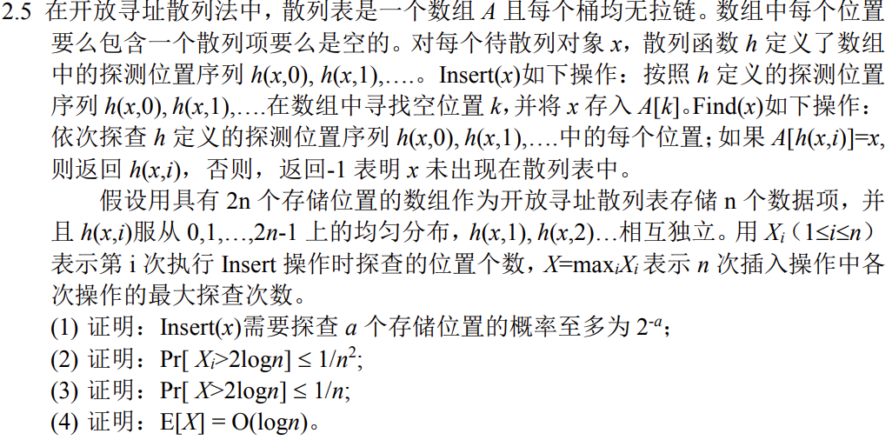
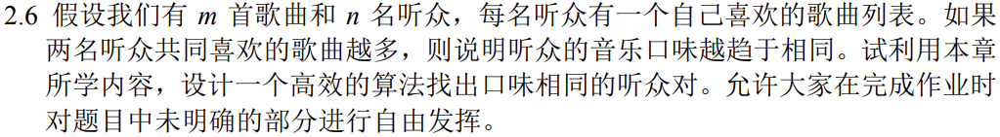

# 作业2

## 2.1

### 2.1.1

对于编号为$i,j$二人，有
$$
(i-10)*s - (i-11) * f = p(i) \\
(j-10)*s - (j-11) * f = p(j)
$$
其中$i,j,p(i),p(j)$均已知且满足$i \neq j$，该方程组显然有解，解得$s,f$即可

### 2.1.2

元素$s,f$的选择各有$q-1$种，因此任何人在仅知道$i,p(i)$的情况下，依次假设$f$的取值来计算$s$，获取有效信息的概率不高于$\frac1{q-1}$，其中$q$是一个长度为101bit的素数，不小于$2^{100}$

因此获知$s$的概率不大于$\frac1{2^{100}-1}$​

## 2.2

对于$X_{ij}$，有$P(X_{ij}=1) = P(X_{ij}=0) = \frac12$，即$E(X_{ij}) = \frac12$

因此，对于$X_{ij}和X_{ab}$，显然无论第$i,j,a,b$次如何取值，一定有$P(X_{ij}X_{ab})=P(X_{ij})P(X_{ab}) $成立

因此满足两两独立

在考虑三个随机变量时，假如我们有$X_{ij},X_{ab},X_{ia}$，当前二者的取值确定时，$X_{ia}$的值完全由前二者确定，即$P(X_{ij}X_{ab}) = P(X_{ij}X_{ab}X_{ia})$

故有$P(X_{ij}X_{ab}X_{ia}) =P(X_{ij}X_{ab}) =P(X_{ij})P(X_{ab}) \neq P(X_{ij})P(X_{ab})P(X_{ia})$​

因此不满足相互独立

## 2.3

假设共有k个桶用于排序，于是有桶中元素个数$d_1,d_2,\dots,d_k$

对于抽取到的任意一个数字，其落入某个桶的概率都是1/k，于是有

$E = \frac{n (d_1 + \dots + d_k)}{k}$，该数学期望仍然是线性的

## 2.4

对当天当地出生的按序编号，模100处理，显然k=2就能保证当天当地的身份证号具有99%的唯一性

## 2.5

### 2.5.1

设对于特定元素x，有(k-1)个元素会产生散列冲突，于是Insert(x)选中每个位置的概率都是1/k，即探查a个存储位置并选中的概率为$k^{-a}$，由于k最小为2，故此时有概率至多为$2^{-a}$

### 2.5.2

由于探测位置是均匀分布，故探查2logn次的概率是$\frac{2n-2logn}{2n}$

于是有$P[X_i > 2logn] \leq \frac{2n-2logn}{2n} = 1-\frac{logn}{n} \leq \frac1{n^2}$

### 2.5.3

根据题意，我们有$P[X>2logn] = P[maxX_i > 2logn] = P[X_1>2logn \or X_2>2logn \or \dots X_n>2logn]$

根据Union Bound，我们有$P[X>2logn] \leq n P[X_i>2logn] = \frac1n$

### 2.5.4

$E[X] = E(maxX_i) $

## 2.6

将m首歌曲依次编号，每名听众维护一个喜欢歌曲集合。则此时寻找口味相同的听众就是寻找相似的集合。

因此，可以使用minHash算法寻找口味相同的听众对。
