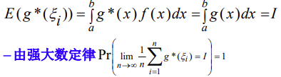
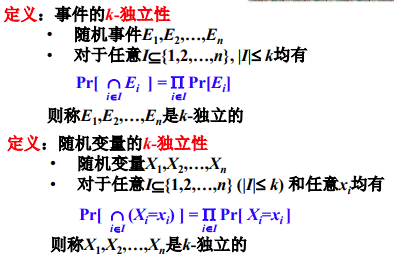
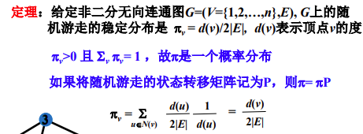
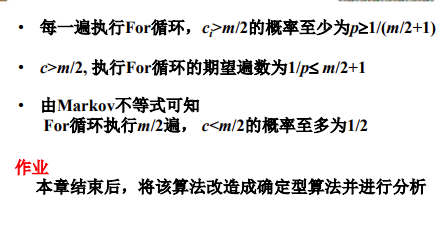
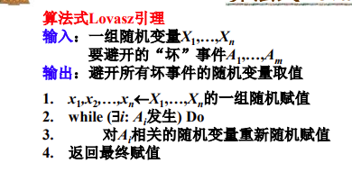

[TOC]

# 考试题型

简答、判断、算法设计、算法分析

# 第1章 绪论

### 随机算法的概念

计算：给定计算模型上的可以机械执行的一系列操作步骤

算法：满足确定性、准确性、终止性且具有输入和输出的计算

随机算法：利用概率和统计方法确定算法某些执行步骤的算法

随机算法的特点：优越性（算法简单、时间复杂性低），随机性（同一实例上多次执行，效果可能完全不同）

### minHash算法

$sim(A,B)=同时取1的行数/两列之一取1的行数$

$minHash_P(A)=全集的随机排列P中首个属于A的行$​

$Pr[minHash_P (A)=minHash_P (B)] = sim(A,B)$​

$sim(A,B) \approx AB两列相等行数/n$

$minHash的重要特征 sim(A,B) 越大，minHash取相同值的概率越高$

# 第2章 随机算法及其分类

### 概念

样本空间、事件集合、概率测度、事件、概率

容斥原理：$|A\cup B \cup C| = |A| + |B| + |C| -(|A\cap B|+|A\cap C|+|B\cap C|) + |A\cap B \cap C|$

union bound：

条件概率：

全概率公式：

概率空间、随机变量

随机变量独立：$Pr[X=x \and Y=y] =Pr[X=x]Pr[Y=y]$  

数学期望：具有线性性质

markov不等式：

 方差：$Var[x] = E[(X-E[x])^2] = E[X^2] - (E[X])^2$

二项分布：期望p，方差p(1-p)

Chebyshev不等式：

尾概率界： $\leq (\frac et)^t$

### 数值随机算法

计算pi值

计算定积分：

### 随机选择与拉斯维加斯算法

LAZYSELECT算法

拉斯维加斯Las Vegas算法：

* 算法不会产生不正确的解
* 算法一旦得到问题的解，就是正确的
* 得到解的概率p>0
* 算法运行过程可能不能产生问题的解
* 反复运行算法，运行时间不确定，最终可以产生问题的解
* 一般用来刻画yes or no 型问题

### 素数测试与蒙特卡洛算法

素数测试算法：

给定待测数字N，测试数据{$1<b_i <N$}，对于$\forall b_i$，若满足$b_i^{N-1} \neq 1 mod N$，则$b_i$是一个合数，若均不满足，也不能说明N就一定是素数

蒙特卡洛算法：

* 用于刻画yes or no型计算问题
* 运行时间是固定的
* 算法得到正确解的概率p>0
* 算法得到错误解的概率1-p>0
* 单面错误蒙特卡洛算法 MC1算法
  * 算法输出yes结论可靠
  * 算法输出no结论可能是错的
* 双面犯错蒙特卡洛算法
  * 算法输出yes和no都可能是错的

### 由拉斯维加斯算法构造MC1算法

运行aT(n)次拉斯维加斯算法A，若拉斯维加斯算法有解，则返回

### 随机排序与舍伍德算法

随机排序：期望时间复杂度为O(nlogn)，类似快速排序pivot的思想

舍伍德算法：

* 确定性算法的随机化
* 消除算法在最好实例和最坏实例之间的差别
* 总能找到问题的正确解

### 最小割与概率放大技术

割：图G的cut是一组边，从G中删除这组边将导致两个或多个连通分量

随机将两个顶点收缩到一起，直到图中只剩两个节点集为止，输出这两个节点集之间的边

概率放大技术：关键操作重复策略

master定理：

# 第3章 球和箱子模型

### 两点分布，几何分布，二项分布

两点分布：$E[X] = p ,  Var[X] = p(1-p)$

几何分布：$P[X=k] = (1-p)^{k-1}p, Pr[X=n+k|X>k]=Pr[X=n], E[X]=\frac 1p , Var[X]=\frac{1-p}{p^2} $

二项分布：$X=\sum_{i=1}^{n}X_i,E[X]=pn,Var[X]=np(1-p)$

### 桶排序及其时间复杂度分析

### 跳表及其复杂度分析

### 球与箱子模型

[M] -> [N]

单射，生日悖论，N个箱子，不存在含有2个球的箱子

满射，赠券收集，N个箱子均不为空

原像，最大负载，N个箱子球最多的有多少个球 

### 通用散列函数

相互独立	 	

k独立			

两两独立   		

相互独立 > k独立 > 两两独立（推导关系反向则不成立）

素数模构造两两独立（均匀性、独立性）

* 

k-通用散列函数族

* 4

k-强通用散列函数族

* 

**k-强通用蕴含k通用**

### 综合应用

散列表

* 拉链技术

# 第4章 Chernoff界

### 切尔诺夫界以及常用形式

矩生成函数

矩生成函数的三点性质

* 两个随机变量的矩生成函数相同，则这两个随机变量相同
* 两个随机变量的各阶矩相同，则这两个随机变量相同
* 两个独立随机变量之和的矩生成函数等于这两个随机变量的矩生成函数之积

Chernoff界：

两个尾不等式

共四个应用：

参数估计

特殊情况

### 集合平衡配置问题

### 随机路由算法

# 第5章 鞅

### 鞅的定义和基本性质

定义

性质

* 

鞅尾不等式

### 鞅的一般形式

定义

几种形式

* 均值为0的随机变量之和是一个鞅
  * 
* 均值为0的随机变量和的平方是一个鞅
  * 

* DOOB序列是一个鞅
  * 

* 性质
  * 

### 鞅的停时定理

通俗解释

两种停时的特征

瓦尔德方程

### 鞅的应用	

模式匹配

空箱子个数

随机图的色数

# 第6章 随机抽样和随机舍入

### 随机游走

放缩

### 马尔可夫链

概率分布

从u出发首次访问v的期望时间$H(u,v) = \frac{2|E|}{d(v)} \leq 2|E|$

覆盖时间上界：找到一棵生成树，共2|V|-1条边，每条边最多2|E|时间内可以访问到，故随机游走的覆盖时间COVER(u)<4|E||V|

等效电阻法：

### 基于随机抽样的算法

非二次剩余：

费马小定理：

二次剩余的判定方法：

非二次剩余的判定方法：

水库抽样算法：

### 蒙特卡罗方法

定义

* 通过反复抽样完成计算的一大类算法
* 又称随机抽样方法或统计实验方法
* 用计算机实现的快速抽样和统计

缺点

* 计算结果存在统计误差
* 方法各要素需要仔细设计才能平衡统计误差和系统误差

步骤

* 构造或描述概率过程
  * 概率过程的数字特征与问题的解相关
  * 问题本身具有随机性，关键在于描述的准确性
  * 问题本身没有随机性，需要人为构造概率过程
* 实现从已知概率分布抽样
  * 随机数产生算法
  * 抽样质量决定方法是否有效
* 建立统计量作为问题的近似解
  * 无偏估计
  * 对实验结果进行考察、登记，得出问题的解

DNF满足性赋值计数问题

改造样本空间的必要性：

* 目标样本在样本空间内非常稀疏 
* 需要很多次的抽样才能找到一个目标样本
* 在得到$(\epsilon,\delta)$近似需要海量的抽样次数

改造样本空间的方法：

* 找到样本空间的一个子空间，其大小易于计算

* 目标样本在子空间内稠密
* 实现子空间内的均匀抽样或根据已知分布抽样
* 建立$(\epsilon,\delta)$近似

# 第7章 概率方法与去随机化

### 概率论证法

最大割问题

独立集算法

### 二阶矩方法

lovasz局部引理

推广定理

构造可满足的k-Sat的解

### 去随机化

MAX-SAT随机算法去随机化

集合平衡配置随机算法去随机化

随机电路去随机化

