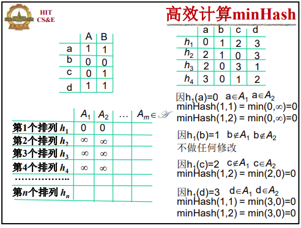
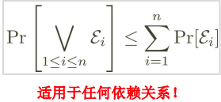
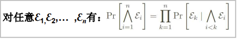
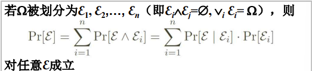
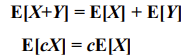
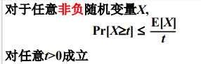
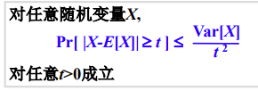
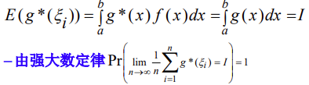

[TOC]

# 第1章 绪论

### 随机算法的概念

计算：给定计算模型上的可以机械执行的一系列操作步骤

算法：满足确定性、准确性、终止性且具有输入和输出的计算

随机算法：利用概率和统计方法确定算法某些执行步骤的算法

随机算法的特点：优越性（算法简单、时间复杂性低），随机性（同一实例上多次执行，效果可能完全不同）

### minHash算法

$sim(A,B)=同时取1的行数/两列之一取1的行数$

$minHash_P(A)=全集的随机排列P中首个属于A的行$​

$Pr[minHash_P (A)=minHash_P (B)] = sim(A,B)$​

$sim(A,B) \approx AB两列相等行数/n$

$minHash的重要特征 sim(A,B) 越大，minHash取相同值的概率越高$

# 第2章 随机算法及其分类

### 概念

样本空间、事件集合、概率测度、事件、概率

容斥原理：$|A\cup B \cup C| = |A| + |B| + |C| -(|A\cap B|+|A\cap C|+|B\cap C|) + |A\cap B \cap C|$

union bound：

条件概率：

全概率公式：

概率空间、随机变量

随机变量独立：$Pr[X=x \and Y=y] =Pr[X=x]Pr[Y=y]$  

数学期望：具有线性性质

markov不等式：

 方差：$Var[x] = E[(X-E[x])^2] = E[X^2] - (E[X])^2$

二项分布：期望p，方差p(1-p)

Chebyshev不等式：

尾概率界： $\leq (\frac et)^t$

### 数值随机算法

计算pi值

计算定积分：

### 随机选择与拉斯维加斯算法

LAZYSELECT算法：

